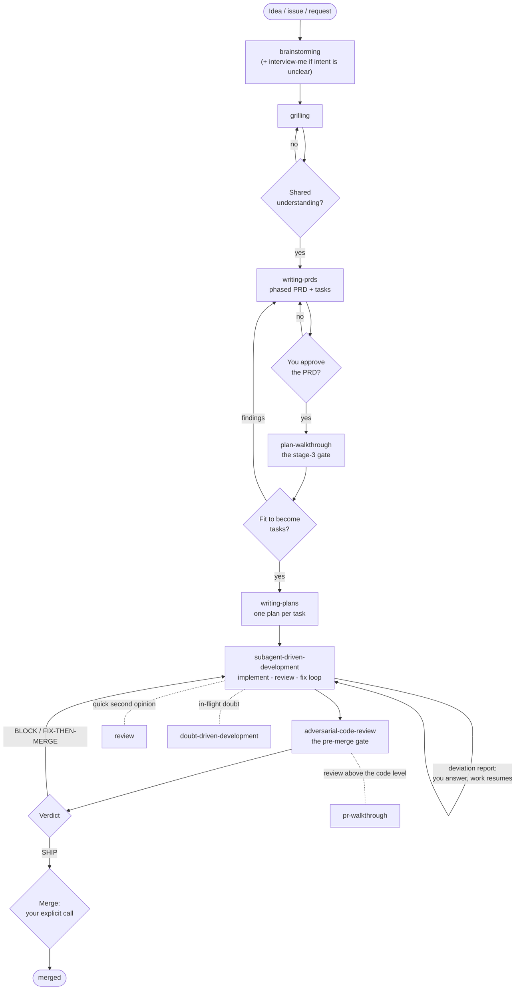

**English** · [Italiano](WORKFLOW_IT.md)

# WORKFLOW: Running a project with this toolkit

This page is for the human who drives agents equipped with these skills,
MCP servers and tools. The [README](README.md) is the catalog: what exists
and how to install it. This page is the practice: how you run a project
with it, day after day.

A note on scope: this practice was distilled on large projects, with 10+
active contributors and 50+ people involved in some capacity. On smaller
projects the skills work as they are; adapt the workflow freely to your
needs as you go. One thing does not change with size: managing and
orchestrating the agents is, and remains, a human role.

## The shape of the team: a pyramid, never inverted

Three roles share the work:

- **You** decide at the gates. You approve designs and PRDs, you judge at
  the review gates, you merge. Everything that cannot be undone cheaply is
  yours.
- **The thinking tier** turns an idea into an approved design, a PRD,
  implementation plans, and the final review before a merge.
- **The execution tier** implements task by task, runs the routine checks,
  keeps the radar on the issues.

**Roles, not headcount.** You can run the whole pipeline with a single
capable agent filling both agent roles, or split them across a strong
planner and a cheaper worker. Both are fine. What matters is the shape:

> **Whoever directs must be at least as capable as whoever is directed,
> never the other way round.**

Direction means planning, reviewing, and deciding what happens next. So:

- PRDs and implementation plans come from your **strongest** model. An
  executor that writes its own plan is where quality collapses; never let
  the working tier plan for itself.
- Execution and mechanical work can go to a cheaper or older model, inside
  the plan's guardrails.
- Review crosses the boundary: the work of one tier is judged by the other
  tier (or by fresh-context reviewer subagents, which is how the review
  skills work anyway), and you hold the final word.

On older or smaller models, the prescriptive skills and a second opinion
from a different model are not optional extras. They **are** the guardrail.
A model two generations behind still does solid work inside this pipeline,
because the skills decide the process and the gates catch the drift.
Expect more fix-loop rounds, not more defects escaping.

## The pipeline, and where you sit

The six stages and their skills are in the
[README](README.md#the-workflow). Here is what matters to you: the
pipeline is built to interrupt you only where a human should decide.

| Gate | When | Your decision |
|---|---|---|
| Shared understanding | after brainstorming/grilling | confirm, or keep answering |
| PRD approval | before any task exists | approve the document, or send it back |
| Plan review | `plan-walkthrough` | judge the PRD/plan before it becomes tasks |
| Deviation reports | during execution | answer the smallest unblocking question, and only when reality diverges from the plan |
| Pre-merge review | `adversarial-code-review` | read the verdict (BLOCK / FIX-THEN-MERGE / SHIP) and decide |
| Merge | end of every branch | yours, explicit, in the moment; agreement on a plan is **not** merge approval |

Between gates you are not needed. The skills carry the process so that
your attention is spent only on decisions.

The same story, as a picture:



### Read the map, then judge

The two walkthrough gates do not just return a verdict. They leave behind
a dossier in `.reviews/` whose core is visual: Mermaid diagrams of what
changed and what it touches (before/after architecture, impact map, phase
graph, traceability matrix, assumption map), plus a traffic light per
review dimension. This matters twice over.

Past hello-world size, impacts and risks are invisible in a raw diff or a
long document; a drawn map makes them visible, so your gate decision is
informed instead of hopeful. And AI makes production so fast that the
volume of PRs and documents grows beyond any line-by-line reading: at
that pace, judging the map first and zooming only where the traffic light
is yellow or red is the only review that scales.

### The daily rhythm

- **Back after a few days?** `/catch-me-up`: what happened while you were
  away, with your own open work listed first.
- **Someone new on the project** (a human, not an agent)?
  `/drink-from-the-firehose`: a role-aware, quiz-driven onboarding where
  every claim carries its source.
- **Routine**: `/issue-triage` as the radar. What is new, what changed,
  what needs you. `/issue-reply` answers what the radar surfaces: brief,
  draft, publish — one issue at a time.
- **Closing the session?** `handoff`: the next session picks up from a
  document, not from your memory.
- **Doubt about a decision while work is in flight?**
  `doubt-driven-development`: a fresh-context second opinion before the
  decision hardens into code.

## Scale down inside a stage, never skip the stage

"Do not skip a stage because the task looks simple" is the rule that
fails most often in practice, and the one that costs most. Every stage
has a light path:

- a small idea gets a **short design**: two sentences in chat, then your
  approval;
- a feasibility question is a **spike**: the output is an answer, not kept
  code;
- a small, well-scoped change to existing code gets a **short in-chat
  design** instead of a spec;
- a small diff gets review's **fast path**: one reviewer, one verifier.

What never scales down is the approval gate. "Simple" tasks are where
unexamined assumptions cause the most wasted work.

## Parallel by default, sandboxed always

One agent in one terminal is the slow way. The toolkit is built to run in
parallel: several agents work at the same time on different tasks, each in
its own git worktree (the `using-git-worktrees` skill sets that up), so
branches never step on each other. A practical steady state is about five
agents at once, spread over one or two projects: enough parallelism to
keep every gate busy, few enough to actually review what comes back.

Parallel work at full permissions needs a hard safety floor: every agent
runs inside an isolated sandbox, [**Lince**](https://lince.sh)
([RisorseArtificiali/lince](https://github.com/RisorseArtificiali/lince)),
so even an agent with every permission granted cannot damage the machine
or anything outside its box. The Lince dashboard is the control room:
live status, token usage, one swimlane per project; five parallel tasks
stay legible at a glance.

The review gates matter more, not less, when five agents produce at once.
Each branch still goes through the same pipeline, and the walkthrough
maps are how one reviewer keeps track of several parallel streams.

## Say it, don't type it

Much of the work is talking, not typing. On Linux,
[**VoxCode**](https://github.com/RisorseArtificiali/voxcode) pipes your
voice to whichever agent has focus, transcribed locally by Whisper; no
audio leaves the machine. It installs with
[Lince](https://lince.sh) (the main entry point); the repo is separate.

The practice this enables: **brain-dumps of several minutes at a time**.
When a task carries context that lives only in your head, saying it out
loud, unstructured, in one long stream, transfers it faster and more
completely than typing ever will. The transcript becomes the agent's
briefing.

It also bends the interview grammar. Brainstorming and the walkthroughs
work in closed, multiple-choice questions; that stays the default. But
when one of those questions triggers more than an answer (a stream of
related ideas you did not know you had), ask the agent to switch to a
free chat or deep-dive turn: talk it through for as long as it takes,
then return to the closed questions.

## Where knowledge lives

- **Markdown is the only source of truth.** PRDs, specs, plans, review
  dossiers, lessons: all plain files in the repo. Anything derived
  (search indexes, embeddings, caches) is rebuildable and never
  authoritative. You fix the markdown, then rebuild the index; never the
  other way round.
- **Review and handoff artifacts live in `.reviews/`** (`prs/`, `plans/`,
  `handoffs/`), excluded per machine via `.git/info/exclude`, never
  listed in `.gitignore`. They stay out of the shared repo but survive
  like repo files, unlike a temp directory that any reboot can wipe.
- **Durable corrections become lessons.** When a human gives a correction
  that should outlive the session (a convention, a hard-won lesson), it is
  recorded as a note: one fact per note, kept terse, so that future
  sessions inherit it. This is the free substitute for persistent agent
  memory.
- **Handoffs connect sessions.** The outgoing session writes the document;
  the incoming one reads it, moves it to `done/`, and continues.
- **Optional: a local search index** (e.g. qmd) over the markdown silos so
  agents can retrieve across docs, reviews and lessons in one query.
  Index, not store: the index is derived, disposable, and rebuilt; the
  markdown stays the truth.

  Keeping it fresh is a maintenance chore, not a per-file job: `qmd update
  && qmd embed` is incremental and idempotent, so run it on a schedule on
  whatever machine has the compute — embedding models want a GPU, and
  inside a CPU-only sandbox the same job is orders of magnitude slower.
  A user systemd timer every 15 minutes is all the automation it needs;
  keep the unit files in-repo (`.qmd/systemd/`) so the wiring travels
  with the project. The force flag (`embed -f`) is only for changing the
  embedding model.

## Wiring a new machine or project

`scripts/wire-machine.sh` does the mechanical part. It is idempotent,
needs no sudo, and everything it does is user-level or in-repo:

```sh
scripts/wire-machine.sh --all        # check prerequisites, install skills, scaffold this repo
scripts/wire-machine.sh --skills     # install the skill sets (AGENT=claude-code by default; override with AGENT=...)
scripts/wire-machine.sh --scaffold   # AGENTS.local.md template + .git/info/exclude entries (run inside a repo)
scripts/wire-machine.sh --check      # prerequisites and auth only
```

### Checklist: one-time per machine

- [ ] Prerequisites present: `git`, `gh` (authenticated), `node`/`npx`. The
      `--check` flag verifies them.
- [ ] Skills installed at user level (e.g. `~/.claude/skills/`) so every
      agent on the box sees them natively; no per-project copies to sync.
- [ ] Credentials sorted: how git and gh authenticate here (credential
      helper, token env vars, explicit push refspecs if needed), and
      written down in the local notes file.
- [ ] Harness limits you will actually hit set deliberately (for example
      per-task turn caps on long builds), not discovered mid-task.

### Checklist: per project

- [ ] MCP registrations workspace-scoped, in-repo (`.mcp.json` and your
      other agents' equivalents); servers started with an explicit project
      flag so they re-activate after any reboot or reset. Global configs
      under `$HOME` are the first thing to evaporate; the repo is the
      only persistent home for machine wiring.
- [ ] `AGENTS.local.md` scaffolded (`--scaffold`), referenced from
      `AGENTS.md`, and filled with this box's truths: read-only paths,
      ephemeral directories, credential routing, known traps. Worktrees do
      not inherit untracked files; symlink it.
- [ ] `.git/info/exclude` holds the machine-local directories
      (`.reviews/`, `.serena/`, `.qmd/`).
- [ ] Optional: a local search index (qmd) over the markdown silos.
      Index, not store — and schedule its maintenance timer
      (unit files in `.qmd/systemd/`).
- [ ] First session: run `/drink-from-the-firehose` to check onboarding
      quality, and `/issue-triage` once to seed the rolling state.
- [ ] When an agent starts on another repository: same ritual. Pipeline
      section in the agents file, workspace MCP registrations, local
      notes file.
