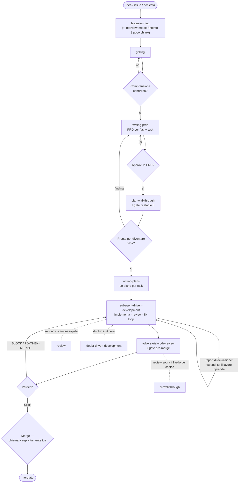

[English](WORKFLOW.md) · **Italiano**

# WORKFLOW — Guidare un progetto con questo toolkit

Questa pagina è per l'umano che guida agenti equipaggiati con queste skill,
server MCP e strumenti. Il [README](README_IT.md) è il catalogo: cosa esiste e
come installarlo. Questa pagina è la pratica: come si guida un progetto con,
giorno dopo giorno.

Una nota di ambito: questa pratica è stata distillata su progetti grandi —
10+ contributor attivi e 50+ persone coinvolte a vario titolo. Sui progetti più
piccoli le skill funzionano così come sono; adattate liberamente il workflow
alle vostre esigenze, di volta in volta. Una cosa non cambia mai con la scala:
gestire e orchestrare gli agenti è, e resta, un ruolo umano.

## La forma della squadra: una piramide, mai rovesciata

Tre ruoli si dividono il lavoro:

- **Tu** — decidi ai gate. Approvi design e PRD, giudichi ai gate di review,
  fai il merge. Tutto ciò che non si può disfare a poco costo è tuo.
- **Il tier del pensiero** — trasforma un'idea in un design approvato, una PRD,
  piani di implementazione e la review finale prima del merge.
- **Il tier di esecuzione** — implementa task per task, gira i controlli di
  routine, tiene il radar sulle issue.

**Ruoli, non teste.** Puoi far girare tutta la pipeline con un unico agente
capiente che copre entrambi i ruoli-agenti, o dividerli tra un pianista forte e
un worker più economico. Entrambe le scelte vanno bene. Ciò che conta è la
forma:

> **Chi dirige deve essere almeno potente quanto chi viene diretto — mai il
> contrario.**

Dirigere significa pianificare, revisionare, decidere cosa succede dopo. Quindi:

- Le PRD e i piani di implementazione li scrive il tuo modello **più forte**.
  Un esecutore che scrive il piano per sé è dove la qualità crolla — mai
  lasciare che il tier operativo pianifichi per sé.
- Esecuzione e lavoro meccanico possono andare a un modello più economico o
  datato, dentro i guardrail del piano.
- La review attraversa il confine: il lavoro di un tier è giudicato dall'altro
  tier (o da subagent reviewer a contesto fresco, che è comunque come lavorano
  le skill di review), e la parola finale è tua.

Con modelli datati o più piccoli, le skill prescrittive e una seconda opinione
da un modello diverso non sono extra opzionali — **sono** il guardrail. Un
modello due generazioni indietro fa comunque lavoro solido dentro questa
pipeline, perché il processo lo decidono le skill e la deriva la intercettano
i gate. Aspettati più round di fix-loop, non più difetti che sfuggono.

## La pipeline, e dove ti siedi tu

I sei stadi e le loro skill sono nel [README](README_IT.md#il-workflow). Qui
conta questo: **la pipeline è costruita per interromperti solo dove dovrebbe
decidere un umano.**

| Gate | Quando | La tua decisione |
|---|---|---|
| Comprensione condivisa | dopo brainstorming/grilling | confermi, o continui a rispondere |
| Approvazione PRD | prima che esista un task qualsiasi | approvi il documento, o lo rimandi indietro |
| Review del piano | `plan-walkthrough` | giudichi PRD/piano prima che diventi task |
| Report di deviazione | durante l'esecuzione | rispondi alla più piccola domanda che sblocca — solo quando la realtà diverge dal piano |
| Review pre-merge | `adversarial-code-review` | leggi il verdetto (BLOCK / FIX-THEN-MERGE / SHIP) e decidi |
| Merge | fine di ogni branch | tuo, esplicito, al momento — l'accordo su un piano **non** è approvazione al merge |

Tra un gate e l'altro non servi. Questo è il punto: le skill portano il
processo, così la tua attenzione si spende solo nelle decisioni.

La stessa storia, in figura:



### Prima la mappa, poi il giudizio

I due gate di walkthrough non restituiscono solo un verdetto — lasciano un
**dossier** in `.reviews/` il cui nucleo è visivo: diagrammi Mermaid di cosa è
cambiato e cosa tocca (architettura prima/dopo, mappa d'impatto, grafo delle
fasi, matrice di tracciabilità, mappa delle assunzioni), più un semaforo per
dimensione di review. Conta due volte.

Oltre la scala hello-world, impatti e rischi sono invisibili in un diff grezzo
o in un documento lungo — una mappa disegnata li rende visibili, così la tua
decisione al gate è informata invece che sperata. E l'AI rende la produzione così
veloce che il volume di PR e documenti cresce oltre ogni lettura riga per riga:
a quel ritmo, giudicare prima la mappa e zoomare solo dove il semaforo è giallo
o rosso è l'unica review che scala.

### Il ritmo quotidiano

- **Torni dopo qualche giorno?** `/catch-me-up` — cosa è successo mentre eri
  via, con il tuo lavoro aperto in cima.
- **Arriva qualcuno di nuovo sul progetto** (un umano, non un agente)?
  `/drink-from-the-firehose` — onboarding role-aware e quiz-driven dove ogni
  affermazione porta la sua fonte.
- **Routine**: `/issue-triage` come radar — cosa è nuovo, cosa è cambiato, cosa
  serve da te.
- **Chiudi la sessione?** `handoff` — la prossima sessione riparte da un
  documento, non dalla tua memoria.
- **Dubbi su una decisione mentre il lavoro è in volo?**
  `doubt-driven-development` — una seconda opinione a contesto fresco prima che
  la decisione si indurisca in codice.

## Ridimensiona dentro lo stadio — mai saltare lo stadio

"Non saltare uno stadio perché il task sembra semplice" è la regola che nella
pratica viene infranta più spesso, ed è quella che costa di più. Ogni stadio ha
una via breve:

- un'idea piccola prende un **design corto** — due frasi in chat, poi la tua
  approvazione;
- una domanda di fattibilità è una **spike**: l'output è una risposta, non
  codice da tenere;
- una modifica piccola e ben delimitata a codice esistente prende un **design
  corto in chat** invece di una spec;
- un diff piccolo prende la **fast path** di review — un reviewer, un verifier.

Quello che non si ridimensiona mai è il gate di approvazione. I task "semplici"
sono dove le assunzioni non esaminate causano più lavoro sprecato.

## Parlarlo, non scriverlo

Gran parte del lavoro è parlare, non digitare. Su Linux,
[**VoxCode**](https://github.com/RisorseArtificiali/voxcode) porta la tua voce
all'agente con il focus, trascritta localmente da Whisper — nessun audio lascia
la macchina. Si installa con [Lince](https://lince.sh) (il punto d'ingresso
principale); il repo è separato.

La pratica che abilita: **brain-dump di minuti interi alla volta**. Quando un
task porta con sé contesto che vive solo nella tua testa, dirlo a voce alta —
non strutturato, in un unico flusso lungo — lo trasferisce più in fretta e più
completamente di quanto farà mai la tastiera. La trascrizione diventa il briefing
dell'agente.

Piega anche la grammatica dell'intervista. Brainstorming e walkthrough lavorano
a domande chiuse, a scelta multipla — quello resta il default. Ma quando una di
quelle domande fa venire più di una risposta — un flusso di idee collegate che
non sapevi di avere — chiedi all'agente di passare a un turno libero di chat o
di deep-dive: parlaci finché serve, poi si torna alle domande chiuse.

## Per default in parallelo, sempre in sandbox

Un agente in un terminale è la via lenta. Il toolkit è costruito per girare in
parallelo: più agenti lavorano allo stesso tempo su task diversi, ciascuno nel
proprio worktree git (la skill `using-git-worktrees` lo prepara), così i branch
non si pestano i piedi. Un regime di crociera pratico è circa cinque agenti
alla volta, distribuiti su uno o due progetti — abbastanza parallelismo da
tenere occupati tutti i gate, abbastanza pochi da rivedere davvero ciò che
torna.

Il lavoro parallelo a permessi pieni richiede un pavimento di sicurezza rigido:
ogni agente gira dentro una sandbox isolata — [**Lince**](https://lince.sh)
([RisorseArtificiali/lince](https://github.com/RisorseArtificiali/lince)) — così
anche un agente con ogni permesso concesso non può danneggiare la macchina né
nulla fuori dal suo box. La dashboard di Lince è la sala di controllo: stato in
tempo reale, uso di token, una swimlane per progetto — cinque task paralleli
restano leggibili a colpo d'occhio.

I gate di review contano più, non meno, quando cinque agenti producono insieme.
Ogni branch percorre comunque la stessa pipeline — e le mappe dei walkthrough
sono il modo in cui un solo reviewer tiene traccia di più flussi paralleli.

## Dove vive la conoscenza

- **Il markdown è l'unica fonte di verità.** PRD, spec, piani, dossier di
  review, lezioni — tutti file semplici nel repo. Tutto ciò che è derivato
  (indici di ricerca, embedding, cache) è ricostruibile e mai autorevole:
  correggi il markdown, poi ricostruisci l'indice. Mai il contrario.
- **Gli artefatti di review e handoff vivono in `.reviews/`** (`prs/`,
  `plans/`, `handoffs/`) — esclusi per macchina via `.git/info/exclude`, mai
  elencati in `.gitignore`. Restano fuori dal repo condiviso ma sopravvivono
  come file di repo, a differenza di una temp dir che qualunque reboot può
  cancellare.
- **Le correzioni durevoli diventano lezioni.** Quando un umano dà una
  correzione che deve sopravvivere alla sessione (una convenzione, una lezione
  pagata cara), viene registrata come nota — un fatto per nota, sintetica — che
  le sessioni future ereditano. È il sostituto gratuito della memoria
  persistente degli agenti.
- **Gli handoff collegano le sessioni.** La sessione in uscita scrive il
  documento; quella in ingresso lo legge, lo sposta in `done/` e continua.
- **Opzionale: un indice di ricerca locale** (es. qmd) sui silos markdown così
  gli agenti recuperano in un'unica query attraverso documenti, review e
  lezioni. Indice, non store: l'indice è derivato, gettabile e ricostruibile —
  il markdown resta la verità.

## Cablare una nuova macchina o progetto

`scripts/wire-machine.sh` fa la parte meccanica. È idempotente, non richiede
sudo, e tutto ciò che fa è a livello utente o nel repo:

```sh
scripts/wire-machine.sh --all        # controlla prerequisiti, installa le skill, scaffolda questo repo
scripts/wire-machine.sh --skills     # installa i set di skill (AGENT=claude-code di default; override con AGENT=...)
scripts/wire-machine.sh --scaffold   # template AGENTS.local.md + voci in .git/info/exclude (dentro un repo)
scripts/wire-machine.sh --check      # solo prerequisiti e auth
```

### Checklist — una volta per macchina

- [ ] Prerequisiti presenti: `git`, `gh` (autenticato), `node`/`npx` — `--check` li verifica.
- [ ] Skill installate a livello utente (es. `~/.claude/skills/`) così ogni
      agente della macchina le vede nativamente — niente copie per-progetto da
      sincronizzare.
- [ ] Credenziali sistemate: come git e gh si autenticano qui (credential
      helper, variabili d'ambiente per i token, refspec espliciti se serve) — e
      scritte nel file di note locali.
- [ ] Limiti dell'harness che incontrerai davvero impostati di proposito (per
      esempio tetti di turni per task su build lunghe), non scoperti a metà task.

### Checklist — per progetto

- [ ] Registrazioni MCP workspace-scoped, nel repo (`.mcp.json` e gli
      equivalenti dei tuoi altri agenti); server avviati con un flag di progetto
      esplicito così si ri-attivano dopo qualunque reboot o reset. Le config
      globali sotto `$HOME` sono le prime a evaporare — il repo è l'unica casa
      persistente del wiring di macchina.
- [ ] `AGENTS.local.md` scaffoldato (`--scaffold`), referenziato da
      `AGENTS.md`, e riempito con le verità di questa macchina: path read-only,
      directory effimere, routing delle credenziali, trappole note. I worktree
      non ereditano i file untracked — fai un symlink.
- [ ] `.git/info/exclude` contiene le directory machine-locali (`.reviews/`,
      `.serena/`, `.qmd/`).
- [ ] Opzionale: un indice di ricerca locale (qmd) sui silos markdown —
      indice, non store.
- [ ] Prima sessione: gira `/drink-from-the-firehose` per verificare la
      qualità dell'onboarding, e `/issue-triage` una volta per inizializzare lo
      stato rolling.
- [ ] Quando un agente inizia su un altro repository: stesso rituale — sezione
      pipeline nel file agenti, registrazioni MCP workspace-scoped, file di
      note locali.
